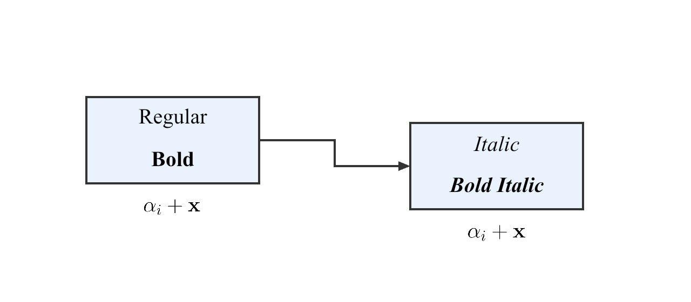

# Figure Rebuild

把论文、技术文档中的参考图，复建成**可编辑的 PowerPoint**。

这是一个独立的 Codex skill，也提供本地命令行工具。适合复刻方法框图、流程图和机制示意图，再按你的反馈逐处修改。

## 看看效果



自建功能示例，预览取自实际导出的 PPT。右侧模块调整位置后，关联的文字、公式和连线在重新构建时随之更新。[下载示例 PPTX](docs/assets/editable-diagram.pptx)。

## 哪些可以编辑

| 内容 | 交付形式 |
| --- | --- |
| 图形、轮廓和连线 | PowerPoint 原生对象，可选中和修改 |
| 普通文字 | 独立文本框，匹配已配置的字体、字号和字面 |
| 数学公式 | LaTeX 排版的 SVG / 高清 PNG；修改源码后重新生成 |
| 照片、纹理等 | 保留图片，可裁剪和移动 |

可以导出独立 PPT，也可以插入已有模板。位图的识别与结构核对由 Codex 完成；本地工具负责构建、导出和检查。

## 安装

需要 Python 3.10+。在终端执行：

```bash
git clone https://github.com/TH1RT3EN-LI/figure-rebuild.git
cd figure-rebuild
python3 -m venv .venv
.venv/bin/python -m pip install -r requirements.txt
.venv/bin/python scripts/install.py
```

安装完成后可在 Codex 中使用 `$figure-rebuild`。导出 PPT 前，还需配置 Node.js、Artifact Tool、Presentations 检查器及本地字体，见[环境配置](docs/usage.md#配置和检查)。这些运行时和字体由使用者提供，项目无需 AutoSlides。

## 怎么用

附上参考图，在 Codex 中说明你的要求，例如：

> 请使用 $figure-rebuild 把这张方法框图复建成 PPT。普通文字和图形保持可编辑，公式用 LaTeX 重排，尽量匹配原图的字体、字号和布局。先给我预览，再根据反馈修改。

通常按「核对原图 → 复建对象 → 检查实际导出 → 局部修改」推进。交付包括 PPTX、预览和编辑性说明；看不清的文字或连接会先标出，解决后再导出。

## 详细文档

- [使用指南](docs/usage.md)：运行时配置、命令行操作、裁剪和模板插入。
- [字体](references/fonts.md) · [公式](references/formulas.md) · [连线与局部修改](references/connections.md)：需要精细复刻时查阅。
- [清单协议](references/scene.md) · [视觉诊断](references/vision.md)：开发和排查问题。
- [更新记录](CHANGELOG.md) · [第三方说明](THIRD_PARTY_NOTICES.md)。

代码采用 [MIT](LICENSE) 许可。测试和展示使用自建素材；字体文件与第三方运行时不随项目分发。
