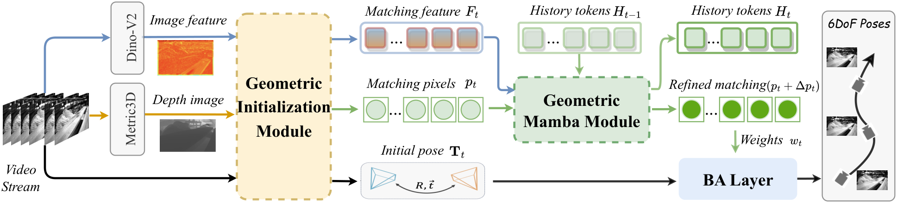
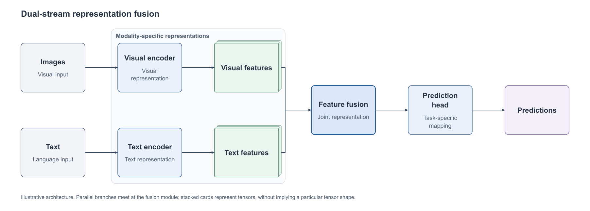

<p align="center">
  
</p>

<h1 align="center">Figure Rebuild</h1>

<p align="center">
  从方法说明创作学术架构图，从参考图复建可编辑 PowerPoint。
</p>

<p align="center">
  <a href="https://github.com/TH1RT3EN-LI/figure-rebuild/actions/workflows/core-tests.yml"></a>
  <!-- Official count badge when install statistics become available: https://skills.sh/b/TH1RT3EN-LI/figure-rebuild -->
  <a href="https://skills.sh/th1rt3en-li/figure-rebuild"></a>
  <a href="LICENSE"></a>
  
</p>

<p align="center">
  <strong>简体中文</strong> · <a href="docs/i18n/README.en.md">English</a> · <a href="docs/i18n/README.ko.md">한국어</a> · <a href="docs/i18n/README.es.md">Español</a>
</p>

Figure Rebuild 从方法说明或代码创作学术架构图，也将已有论文方法图、流程图和机制示意图重绘为可编辑的 PowerPoint。

原创模式由调用方智能体理解方法、设计模块与关系，再用 `create` 生成布局、活动文字、张量示意和有向连线。提供串行流程、并行汇合、训练反馈的可执行起点，保留原始说明与设计规格；导出后检查真实 PPT 预览。创作规则与边界见[学术创作指南](references/academic-creation.md)。

项目以 Codex 开发和测试，提供本地命令行工具与 Codex skill。命令行接口也可用于接入其他智能体。

## 安装 Skill

在目标项目中运行：

```bash
npx skills add TH1RT3EN-LI/figure-rebuild
```

按提示选择 Codex；如需在所有项目中使用，可运行 `npx skills add TH1RT3EN-LI/figure-rebuild --agent codex --global`。安装命令下载 Skill、脚本和参考文档；Python 依赖及 PPT 导出环境仍需按[使用指南](docs/usage.md#安装)配置。

## 功能

| 功能 | 用法 |
| --- | --- |
| 从方法说明创作 | 调用方填写结构规格，`create --spec creation.json --job new-job`，无需参考图；审阅后用 `build` 导出 |
| 导出独立 PPTX | `build --manifest manifest.json`，从审阅后的清单生成可编辑单页 |
| 检查原生 PDF 预览 | `build --preview-backend libreoffice-pdf`，从最终 PPT 的 PDF 导出生成预览，并保留直接 PNG；[零宽细线及验收边界](references/native-pdf-preview.md) |
| 检查原生路径预览 | `build --preview-backend native-svg`，按最终 PPT 的实际平铺纯色路径生成三尺寸预览；[支持域和独立重放](references/native-svg-preview.md) |
| 统一采样原生填充前景 | `build --artifact-path-prefix-grid request.json`，将实际填充路径前缀及其不透明画布背景共同采样，交付路径保持可编辑；[有限网格与顺序核验](references/native-path-prefix-grid.md) |
| 检查透明图像的 PDF 预览 | `build --preview-backend libreoffice-pdf-rgb`，保留原始导出，并生成仅修改零透明度 RGB 的独立 PDF；[逐像素证明与验收边界](references/pdf-zero-alpha-rgb.md) |
| 修复照片导出坐标舍入 | `build --preview-backend libreoffice-pdf-photos`，在独立 PDF 中恢复最终 PPT 的不透明照片坐标，原始导出和媒体保留；[精确样本匹配及验收边界](references/native-photo-matrices.md) |
| 恢复缺失的字形 Unicode | `python -m figure_rebuild.font_unicode --spec glyphs.json --output receipt.json`，由精确轮廓及度量匹配唯一候选；[字体绑定与数学脚本范围](references/font-unicode-recovery.md) |
| 生成时插入指定位置 | `build --manifest manifest.json --base base.pptx --slide-id ID --placement x y width height --output new-deck.pptx` |
| 生成后插入指定位置 | `insert --input figure.pptx --base base.pptx --slide-id ID --placement x y width height --output new-deck.pptx`，直接复用已生成的单页 PPTX |

两种插入方式都将整个源画布等比缩放并居中放入指定区域，文字、线宽同步缩放，保留原生对象的可编辑性、目标模板及其他页。区域比例不同时居中留空，不裁切内容。坐标使用 CSS 像素（96 px = 1 英寸）；目标页使用 `inspect-base` 查出的原生 slide ID。输出写入新文件，不覆盖原稿。

生成后的 `insert` 直接修改 PPTX 的 OOXML 包，无需配置 PPT 导出运行时。来源限本项目生成的受支持单页 PPTX，任意演示文稿、动画、图表和 OLE 等不在完整支持范围内。命令示例与边界见[插入使用指南](docs/usage.md#插入现有模板)。

## 效果预览

以 [MambaVO（CVPR 2025）](https://openaccess.thecvf.com/content/CVPR2025/html/Wang_MambaVO_Deep_Visual_Odometry_Based_on_Sequential_Matching_Refinement_and_CVPR_2025_paper.html) 的 Figure 1 为例。

**原图**



**重绘过程**


## 可编辑内容

| 内容 | 交付形式 |
| --- | --- |
| 图形与连线 | PowerPoint 原生对象 |
| 普通文字 | 独立文本框，可修改字体、字号和内容 |
| 数学公式 | LaTeX 生成的 SVG / 高清 PNG，修改源码后重新排版 |
| 照片与热图 | 保留图片，可移动和裁剪 |

支持导出独立 PPTX，也可将重绘结果插入现有演示文稿。

## 快速开始

需要 Python 3.10+。

```bash
git clone https://github.com/TH1RT3EN-LI/figure-rebuild.git
cd figure-rebuild
python3 -m venv .venv
.venv/bin/python -m pip install -e .
```

已有源码 checkout 时，也可用本地安装器将其注册为 Codex skill：

```bash
.venv/bin/python scripts/install.py
```

使用 `build` 生成 PPTX 前，还需[配置导出环境](docs/usage.md#配置和检查)：Node.js 20.9+、Codex Artifact Tool、Presentations 检查器及本地字体。对已生成的单页 PPTX 使用 `insert` 无需这套导出环境。

## 使用

`figure-rebuild` 命令提供素材准备、场景审阅和 PPTX 导出。图像理解与场景清单由使用者或调用方智能体完成，完整步骤见[使用指南](docs/usage.md)。

在 Codex 中，可附上参考图并调用 `$figure-rebuild`：

> 请用 $figure-rebuild 将这张图重绘成可编辑的 PPT。保留原图文字、布局和连线，公式用 LaTeX 重排，并提供预览供我核对。

输出包括 PPTX、导出预览和原图对照，也可继续调整局部内容。

也可直接描述研究方法：

> 请用 $figure-rebuild 为这个方法创作论文架构图：图像和文本分别编码，再融合特征并预测。突出融合模块，交付可编辑 PPT 和预览，不增加未说明的科学关系。

调用方先设计结构，再调用项目绘制。三个原创示例规格为[串行流程](docs/assets/creation-pipeline.json)、[双分支融合](docs/assets/creation-parallel-fusion.json)和[训练反馈](docs/assets/creation-training-feedback.json)，均为合成示例，不对应真实论文结论。

**原创双分支示例的实际 PPT 预览**



[可编辑 PPT](docs/assets/creation-parallel-fusion.pptx) · [创作规格](docs/assets/creation-parallel-fusion.json)

## 项目文档

[使用指南](docs/usage.md) · [架构与目录](docs/architecture.md) · [贡献指南](.github/CONTRIBUTING.md) · [更新记录](docs/CHANGELOG.md)

## 许可

代码采用 [MIT](LICENSE) 许可。论文图示与其他素材的来源、许可见 [THIRD_PARTY_NOTICES](docs/THIRD_PARTY_NOTICES.md)。
