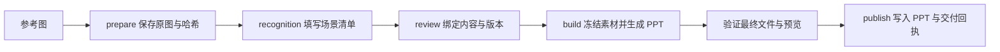

# 架构与数据流

Figure Rebuild 用可审阅的场景清单连接参考图和 PowerPoint 导出。位图识别由调用方模型完成；Python 负责输入、清单、素材与交付审计，JavaScript 负责调用外部 PPT 运行时构建画布。

## 目录职责

| 目录或文件 | 职责 |
| --- | --- |
| `src/figure_rebuild/` | Python 包，处理清单、素材、配置、几何、审计与命令行流程 |
| `src/figure_rebuild/powerpoint/` | 随 wheel 分发的 JavaScript PPT 构建、预检、曲线与文字测量代码 |
| `scripts/` | Codex skill 的源码入口和安装辅助脚本 |
| `SKILL.md`、`agents/` | 调用方模型的复建流程与 Codex 技能元数据 |
| `references/` | 场景协议、字体、公式、连线、视觉诊断与录制说明 |
| `tests/` | 便携 Python / Node 测试和附带许可说明的测试素材 |
| `docs/` | 使用、架构、更新记录和第三方说明 |
| `docs/i18n/` | 英语、韩语和西班牙语 README |
| `docs/assets/` | 有来源记录的展示图片、录像与审计材料 |
| `requirements/` | 核心、视觉和来源分析的 pip 安装清单 |
| `.github/` | CI 工作流和贡献指南 |
| `pyproject.toml` | 包元数据、依赖分组和命令行入口 |
| `.local/` | 被 Git 忽略的本地配置、任务与集成输出 |

## 从识别到交付

`recognition` 是填写清单的阶段，不是单独的 CLI 命令；`publish` 是构建内部的本地文件交付步骤。复建后仍需对照实际预览核对结果，用户视觉验收与调用方审阅分别记录。

### 识别与清单

`prepare` 创建新任务，把原始文件复制到 `sources/`，记录来源分类、尺寸和 SHA256。位图初始清单不含对象，调用方须对照原图填写文字、路径、层次、稳定对象 ID 和连接关系；支持的 SVG 元素可由 `svg_import.py` 导入，再进行审阅。

`validate.py` 检查清单和素材约束；`connections.py` 解析模块连线及标签关联，并支持绑定版本与内容摘要的局部修改。`formula_asset.py`、`scene_compile.py` 将经审计的公式和语义连线编译为构建场景，保留原始清单。

### 审阅与版本

`review.py` 计算清单内容摘要。`review` 保存审阅说明、版本与摘要；`build` 再次核对，内容改变后原审阅会失效。局部修改应递增 `revision`，保留已有快照，再重新审阅。

任务的 `build/run-*` 目录保存清单、输入素材及已有模板的快照。目录分配使用锁与独占创建，构建本身在保留快照后继续执行。来源字节和公式依赖的哈希会在冻结与交付前再次检查。

### 构建与验证

`build.mjs` 使用外部 Codex Artifact Tool 生成 PPT。`postprocess.py`、`semantic_ooxml.py` 和 `native_connections.py` 处理原生路径、组、公式素材及连接端点；`package.py` 按原生 slide ID 将结果插入已有 PPT，并检查保留关系。

生成时指定 `--base` 与 `--placement`，`powerpoint/placement.mjs` 将源画布等比居中映射到目标区域。生成后使用 `insert`，由 `placement.py` 对已生成的单页原生对象应用相同的映射，再交给 `package.py` 合并。后者同时缩放坐标、字号、线宽和绝对间距，保留组的坐标比例、连接端点以及媒体原始字节，并将实际放置区域写入合并回执。

字体配置、字面与字形覆盖在预检中核对；`text_fit.mjs` 测量文字放置。最终候选文件经过 Presentations 检查器和 Artifact Tool 导入检查，再从实际文件生成预览。`compare.py` 提供原图对照；可选视觉模块补充裁剪和位置诊断。

### 本地交付

`publish.py` 先暂存完整文件，再独占写入交付回执与 PPT，避免覆盖已有交付。PPT 是提交点：回执仅在文件存在且哈希匹配时有效。默认输出位于任务的 `exports/`，审计材料位于该次 `build/run-*`。

## 运行时与素材边界

Python 核心安装、SVG 导入、清单审阅和生成后的 `insert` 可独立执行。使用 `build` 导出 PPT 另需用户提供 Node.js、Artifact Tool、相关 Node 包、Presentations 检查器及字体。`insert` 仅处理 OOXML 与保留性检查，不重新渲染或验证公式采样率。可选 Python 依赖用于视觉诊断和 PDF 字体分析；LaTeX 公式生成还需要可用的外部引擎与转换工具。

CLI 和构建所配置的 Python 可以属于不同环境。包内 `_bootstrap.py` 只登记 Figure Rebuild 自身的模块位置，第三方依赖仍由配置的 Python 加载；不会把 CLI 所在的整个 `site-packages` 加入子进程导入路径。`runtime_probe.py` 在实际构建解释器中核对字体依赖，`powerpoint/runtime.mjs` 统一调用这一入口。

Python wheel 包含 Python 模块和 `powerpoint/` 后端，不包含完整 Codex skill。skill 安装仍需源码 checkout 中的入口、`SKILL.md`、`agents/` 和 `references/`。配置优先使用 `FIGURE_REBUILD_CONFIG`，否则使用兼容的 checkout 本地配置或用户配置目录；用户任务与配置不应写入已安装包目录。

CI 的便携测试不等于实际 PPT 导出或 Office 播放验证。像素诊断不证明科研关系正确；普通文字、原生图形、公式图版与保留图片应按实际对象类型描述编辑性。

来源与许可记录见 [第三方说明](THIRD_PARTY_NOTICES.md) 和 [LICENSE](../LICENSE)。贡献与复现要求见 [CONTRIBUTING](../.github/CONTRIBUTING.md)，命令示例见 [使用指南](usage.md)。
