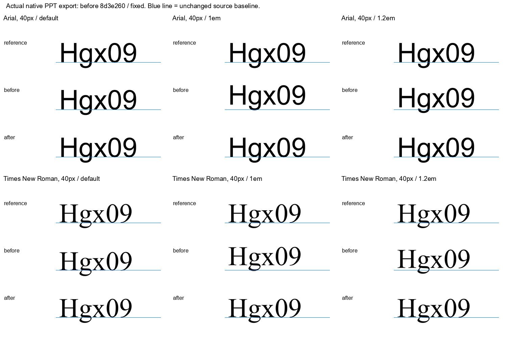

# 细节修复与验证进度

[冻结的 126 图审查](2026-10-03-detail-audit.md)记录了修复前的 296 项问题。稳定检查点 `7e81f9c` 经独立副本执行 615 项 Python 测试（608 通过、7 跳过），wheel 55 文件与源码包 159 文件检查通过，GitHub Core checks 通过。这里区分项目能力修复、实际输出检查和逐图内容问题关闭；测试通过不等于整批图通过验收。用户验收保持 pending。

本次几何与上下文检查点在冻结副本中通过 692 项 Python 测试（685 通过、7 跳过）、44 项 Node 测试；wheel 59 文件、源码包 173 文件检查通过。测试用的两份源几何 JSON 也随源码包分发，不依赖本地论文目录。

## 通用实现修复

- **文字位置**：使用实际渲染器与相同字体字节的度量，保留源 anchor、框、旋转中心与垂直对齐。原生 inset 校准后，显式行高用百分比表达，消除点数行距在 Artifact 和 LibreOffice 中不同首行 leading 的影响。小数百分比多行文本仍可能在部分应用中逐行积累误差，回执明确要求复查。
- **图片实例**：保留默认 contain，增加显式 stretch；裁剪相对于完整素材，修复裁后 SVG 内容泄漏。PDF 提取绑定真实绘制实例、完整变换、矩形裁剪、软蒙版及翻转；不能把 xref 或裁后的文本字典 bbox 当作完整实例身份与放置框。
- **源路径与字形**：按源资源引用和实际绘制顺序提取精确 Bezier。字形轮廓是可编辑路径，不是 live text。虚线以源路径长度和相位拆成真实子曲线，不先折线化；报告弧长误差与接缝处理。简单、不相交且不嵌套的多边形可证明 evenodd/nonzero 等价；曲线通过凸控制多边形、单调投影和精确绕数证明扩展，其余情况继续拒绝。矩形边界的小数舍入容差须显式开启并记录误差，默认仍严格。
- **原生渐变**：支持原生路径中的连续线性渐变、任意物理角度、多个色标和透明度，核验最终 XML。SVG 与 PPT 使用同一包含 cubic 控制点的原生路径框。原生角度按 1/60000 度量化，导出器差 1 单位的浮点截断有明确校准回执。非均匀色标透明度在当前 Artifact 预览中的插值差异单独标记，不能通过修改参考图来掩盖。
- **稳定渲染**：真实 core dump 将退出崩溃定位到 Skia Vulkan 后台资源清理与 NVIDIA 进程退出清理重叠。进程内 CPU Canvas 适配在首次导入 Artifact 前选择并验证 CPU；不修改依赖文件，不吞掉进程失败。新后端会改变部分抗锯齿，必须生成新的预览和审查绑定。
- **诊断和审查**：独立源画布网格不依赖已输出的对象；预算遗漏明确记录。source_evidence 核对声明的字面与连接。review-output 绑定实际源图、清单、PPT、预览和交付文件，拒绝复用过期报告；构建预览、应用验证与用户接受分别记录。

## 实际验证

初始实现 dd28b66 的 GitHub Core checks 通过。第二个稳定检查点在隔离副本中执行 473 项 Python 测试（466 通过、7 个可选环境项跳过），44 项 Node 测试全部通过；wheel（51 文件）与源码包（143 文件）检查通过。该检查点不含随后完成的源裁切/颜色修复。新的源处理检查点已在独立副本通过 542 项 Python 测试（535 通过、7 跳过），wheel（54 文件）与源码包（153 文件）检查通过；Node 代码未再改变，沿用前述 44 项验证。

- 36 个原始文字探针在 Artifact 中最大偏移从 7.5 降至 0.25 源像素。最终 160 个实际导出案例覆盖缩放、多行、旋转及垂直对齐，Artifact 4x 墨迹边界与独立物理基线参考一致；LibreOffice 栅格对照最大 0.5 物理像素。36 例的 LibreOffice PDF 原点最大差约 0.668 源像素。
- 长段落实测仍存在限制：LibreOffice 将小数百分比行距截为整百分比，50 行、目标 28 px 的样例累计差约 8.95 px。项目记录需要应用复查，不把短标签的改善推广为任意长段落完全一致。
- 8 个图片实例通过素材 SHA、完整裁剪与框坐标核验，涵盖窄长素材、重复资源及分数框。原来被误缩小的 34×236 PDF 图片，4 个可见细条采样点与源 PDF 高倍率渲染逐通道一致。
- 原生渐变实际探针覆盖 16 个方向/多色标/路径遮罩/全局透明度案例，并独立复核曲线路径和非均匀色标 alpha。Artifact 的普通渐变内部采样差不超过 1/255；LibreOffice 有小幅量化差异。非均匀 alpha 的 Artifact 差异可达 36/255，原生 XML 与 LibreOffice 对照正确，保留明确限制。
- 全量旧清单重建 v2：124 成功、2 个退出崩溃，失败记录保留。372 张预览及 1,247 项图片框/素材字节完成绑定核验。CPU 适配连续 8 次复现探针及 7 张实际图均正常退出，包括两张原失败图；固定 ab5c459 的完整 v3 重建现已 126/126 成功，378 张实际预览和 1,255 项图片素材/框核验通过。完整 v3 复查现覆盖 126 图、296 个冻结问题；补充交叉检查 XC01 已单独实看，仍开放。v3 中仅 8 个局部问题已解决，其他问题不能靠重建自动关闭。
- v2 前 40 图已实际逐图复查，78 条冻结问题中建议局部关闭 5 条、73 条仍开放，并发现 Reverse Path 被旧手绘曲线遮挡得更重。该可见退步在新尝试中修复；箭头风格和字体仍继续按真实源资源处理。这些检查不关闭未修的文字/公式内容错误。
- CURE f04/f06、SGL f01/f02、MTGNN f02、TPUv4 f01/f05、ALEX f02、GPT-3 f1-1、DPO f01、GraphMAE2 f02、Skill Library f01 和后述新源构建已分别完成实际输出复查，目前关闭 148 条原可见问题，另有 1 条渲染定位关闭；全局冻结清单仍有 147 项开放。SGL f01 D06 与 MTGNN f02 D03 的自动语义覆盖缺口继续开放；TPUv4 f01 D06、GPT-3 D02 与 Skill Library D07 的字体匹配，以及 Skill Library D08 的箭头/重叠自动诊断也保留开放。DPO D03 的栅格源与原生细边采样差异仍开放。GraphMAE2 通过实际 LibreOffice 应用核验，但 Artifact 的圆端/圆角预览差异新增为独立开放问题。每项关闭均绑定原源与实际输出 SHA；用户验收仍待定。TPUv4 f05 主体保留作者原始位图，图注为字形路径，不称全原生图。

## 新源构建与几何修复

固定 `7e81f9c` 的第二次全库源 PDF 清点覆盖 126 图：51 张零未处理绘制项（其中 15 张纯矢量、36 张包含作者源图片）、74 张部分支持、1 张保持原命令预算异常。125 张完成全部源绘制项核账与素材 SHA 验证；未处理对象从前一轮 2,318 降至 1,621，没有新增退化。零未处理项仅表示来源覆盖完整，不能代替视觉验收。

13 张纯矢量候选已各自完成首次实际 CLI 构建、1×/2×/4×全图及问题局部复核，没有构建后手调几何，合计关闭 17 项原可见问题。另两张候选复用已有 MTGNN、ALEX 的独立输出证据，未重算为首次构建成功。MoCo 两图与 CoCoNuT 新增的三个 Artifact 预览线帽/转角问题仍开放；原生 PPT 属性及实际 LibreOffice 输出正确。字形是路径，自动语义诊断仍为 `NOT_PROVIDED`；Ansor 原诊断缺口没有随视觉问题一起关闭。

下一批项目修复保留了 SAM2 环形路径的真实曲线及中心孔洞，严格证明单个 clip 的嵌套关系；其他裁切仍须逐一证明。D4RT 原 101 个路径拒绝项现为 31 个支持、70 个有证据的无绘制跳过，原已支持对象几何和样式不变；35 个图片透明组仍未在严格模式中放行；新的显式 RGB 组采样模式已逐个提取并核账，完整 D4RT 实际构建与视觉检查仍在进行。

单个有效填充轮廓末尾的孤立 moveto 原先会被误判为第二个退化轮廓。现在只在证明副本中排除无绘制命令的空子路径，源命令与描边保持不变；83 个实际 evenodd 失败项中 67 个通过，后续裁切阻塞为零，其余 16 个仍未知。

恒定轴向渐变接口从真实原生事件与资源指针绑定源绘制，保留蒙版/组限制与所有裁切；有限延伸的边界验证使用原始坐标和矩阵的精确有理数，防止极小越界被浮点平移抹掉。SAM2 的白色极细区域没有被删除：16× 原生对照双方均有 3 个非零像素，两个像素的 alpha 差 1/255；1×/2×/4× 看不见不构成空几何证明。最终 PPT 仍须另行检查。

大型源图可显式设定解析预算，同时保留共享命令消耗、单路径、节点与层次限制。独立测试发现并修复了“失败路径不计入总预算”和“未使用定义绕过深度限制”两处漏洞。真实 2026-03-f02 在明确的 250,000 预算下读取 218,161 条命令；默认 200,000 仍拒绝，读取成功不等于成图完成。

新路径处理支持仅在证明副本中进行填充隐式闭合，以及单一轮廓各段控制凸包严格分离的填充规则等价证明。D4RT 30 个真实填充通过原生 PDF 8x 对照，未解决的描边未混入关闭计数。矩形交集、向外舍入的描边包络、透明绘制与零面积空格的跳过均有独立验证。

InstructGPT v3 新暴露的灰框已定位为旧外部适配器把 soft-mask 定义内部绘制误当页面内容。新的原生上下文接口核对完整绘制事件，并区分蒙版定义、蒙版使用与普通页面对象；黑色定义形状已被正确排除，受蒙版控制的白色绘制仍明确未处理。新草稿仍有 96 个未解决项，未生成伪完整 PPT，也未关闭该整图问题。

逐项状态与外部证据 SHA 见[问题关闭记录](2026-10-04-detail-resolutions.json)。

## 图片成图与跨应用复核

固定 `7e81f9c` 的新源图片成图批次已有首 16 张完成正式检查：原始源图、实际 PPT、1×/2×/4×预览与真实 LibreOffice 输出均有绑定。根复核确认 642 个文件引用 SHA（474 个独立文件）及全部 16 份 review-output 完整性；44 项关闭提议中 8 项先前已关闭，本次净关闭 36 项。保留 20 个新增预览/原生残差，不把有已知问题的整图称为通过。AST 源标签实为大写 `Left`，原冻结审查对大小写的前提已在追加说明中纠正，未修改源文字。

32 张新源图片成图现已全部完成正式检查，共 106 项原问题中有 95 项关闭提议、11 项保持开放。根复核分两批检查 1,419 个证据引用（两个批次分别涉及 474 与 545 个独立文件）及 32 份 review-output；排除 18 项历史关闭后净新增 77 项关闭。32 次首次实际构建均成功，没有构建后手调对象；11,006 条原生路径、346 个作者原始图片实例、零 live text。40 个新预览/原生问题另列，不能将首构建成功当作首构建完美。

默认 LibreOffice PDF 导出会把部分 PNG 重编码为 JPEG 并降低分辨率，造成色噪。新验证明确使用无损压缩、禁止降采样，核对 PDF 图像过滤器与原始像素尺寸。TPU 的压缩色噪因此消失，但 Fawkes、EWE、CodeMOSA、ZeRO 等图的部分灰框在无损输出仍存在；它们继续开放。原 PPT 和先前证据保持不变。

追加的独立直接 PNG 试验使用相同未改 PPT，绕过 PDF：Fawkes、EWE 和 SAM2 的外矩形灰框消失，故这些外框改归 PDF 验证链限制，不以改源图透明 RGB 或增添无描边属性来掩盖。Fawkes 暗色括号内部的细拼接缝及 SAM2 照片采样残差仍存在，继续开放。项目的可选 LibreOffice 原生预览正在据此调整为直接 PNG，PDF 保留作另一条文档证据；尚未作为已交付功能计入本检查点。

Artifact 的原始 1× 图片缩小预览会遗漏细线。真实 SGL 及相位夹具确认，它使用的线性采样与 Strict 图片边界会失去 mipmap 效果，切换 low/medium/high 无法修复。现有实际 PPT 4× 渲染后 Lanczos3 缩小能恢复 SGL 细边；16× 缩小的夹具需要 8× 超采样才保留全部线相位，而且字体灰度可能改变。原始预览保留，不将超采样显示误称为直接原生 1× 或任意倍率无损。

稳定检查点 `87ad02d` 新增显式 `allow_native_rgb_group_sampling`，保留真实 RGB/ICC 颜色空间及原生回调，不宣称 profile 等价或共享组拆分精确。采样结果绑定源 PDF、真实绘制、组区间、颜色空间和素材 SHA，要求整图复核且不报告通用 RGB/alpha 误差上界。独立检查发现的 Form 中途改变 DefaultRGB 漏洞，在严格和显式采样两种模式下都已修复。D4RT 35 个图片实例的第三次固定复跑逐字节一致；实际 PPT 尚待完成。该检查点 704 项 Python 测试中 697 通过、7 跳过，wheel 59 文件和源码包 175 文件检查通过；未改 Node，沿用此前 44 项验证。`bc8cf54` 的 GitHub 全部 CI 已通过。

SAM2 完整新候选有 647 张真实源图片、134 条路径和 1 个恒定渐变路径，共 782 个对象，没有未处理源绘制项，首次实际构建成功。原生图片单层对照与最终成图必须分开判断：Artifact 完整预览中部分单层灰框消失，但真实 LibreOffice 无损完整输出仍重现卡片边框及照片接缝。该图的视觉问题仍开放，来源覆盖与构建成功没有代替验收。

## 尚未完成

整批内容修复、最新完整输出的逐图检查，以及从源素材首次生成能力验证仍在进行。复杂 PDF 图片裁切与显式非轴向放置已完成有限支持。SAM2 的 CMYK 反色已通过真实 native fill-image 解码修复：647 图片、791 页绘制项完成绑定，364 个复杂裁切和 283 个矩形实例完成提取；独立复查及最终代码重跑逐资产一致。独立原生图片层对照随后发现部分卡片边角突线、Time 尾部细线及采样差异；因此提取与颜色验证不代表裁剪外观通过，新候选改为保留真实资源/上下文的 native 绘制转发。其第 646 个 SVG/image-info 项实际对应 PDF shading，仍独立处理，不能伪造 image 身份。显式 native occurrence 模式已保留真实图片及其 clip/group/SMask 绘制上下文；独立 72 个案例通过，另 16 个真实 PDF 图片与 ROI 对照逐像素一致，未知组合仍拒绝。Swift 已使用该模式完成完整 1x/2x/4x 实际输出复查，关闭原箭头/文字问题和新增遮挡问题；169 条原生路径与 1 个真实源位图，保留采样差异说明。尚不支持的组合效果保留未解决状态。位图主体的字体、细数学笔画、箭头和梯度必须对照原图，不能凭模板补全。Native cap/join/miter 在 Artifact 2.8.59 预览中也存在已确认的支持限制。

原生 PowerPoint/WPS 播放尚未验证。当前证据不能用来声称所有图都已完美，或项目对任意输入具有无条件一次完美的能力。
